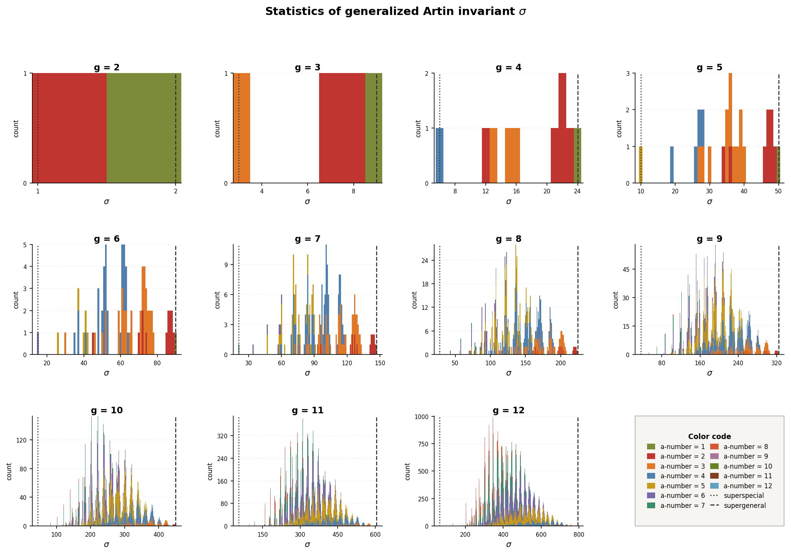

# Domino from Cyclic Matrix

A Python implementation of a simplified version of **Nygaard's reconstruction algorithm**, which computes invariants of the formal Brauer group $\widehat{\mathrm{Br}}_X$ of a supersingular abelian $g$-fold. The simplification relies on two key assumptions:

1. **Supersingularity**: $X$ is supersingular, so $\widehat{\mathrm{Br}}_X$ is unipotent and $H^2(X, W\mathcal{O}_X)$ consists purely of domino pieces.
2. **Cyclic Frobenius action**: the $F$-crystal Frobenius $\varphi$ acts cyclically on $M = H^1_{\mathrm{crys}}(X/W)$, i.e. there is a basis in which the matrix of $\varphi$ is a weighted cyclic permutation matrix, or **cyclic matrix** for short.

---

## AI Disclaimer

This package was designed by Yuanning Zhang and written almost entirely by Claude Code. YZ provided the mathematical framework and pseudocode for this project, and Claude Code translated it into Python programs. The output has been compared and verified up to dimension 6 by handmade computations of YZ.

---

## Mathematical Background

### Setting

Let $X$ be a supersingular abelian $g$-fold over an algebraically closed field $k$ of characteristic $p$. The covariant Dieudonné module $M = H^1_{\mathrm{crys}}(X/W)$ is the first crystalline cohomology of $X$: a free $W(k)$-module of rank $2g$ carrying the structure of an $F$-crystal $(M,\varphi)$.

This program works under the assumption that $\varphi$ acts **cyclically** on $M$: there exists a basis $e_1, \ldots, e_{2g}$ of $M$ such that

$$\varphi(e_i) = p^{a_i} u_i \, e_{i+1}$$

for units $u_i \in W(k)^\times$, and the indices are interpreted in the mod $2g$ sense. The **exponent sequence** $a = (a_1, \ldots, a_{2g})$ records the $p$-adic valuations of the nonzero entries of this cyclic matrix. Because $X$ is supersingular of dimension $g$, we require the sequence $a$ to satisfy the following conditions:

- $a_i \in \{0, 1\}$ for all $i$
- $\sum a_i = g$

Two exponent sequences differing by a cyclic rotation define isomorphic $F$-crystals, so we work with **rotation equivalence classes**.

### From $H_{\mathrm{crys}}^1$ to $H_{\mathrm{crys}}^2$: the exterior square

The $n$-th crystalline cohomology $H^n_{\mathrm{crys}}$ of any  abelian variety $X/k$ is computed as the $n$-th exterior power of $H^1_{\mathrm{crys}}$ as $F$-crystals. The case of interest for this project is $n=2$:

$$H^2_{\mathrm{crys}}(X/W) = \Lambda^2 H^1_{\mathrm{crys}}(X/W) = \Lambda^2 M.$$

### Nygaard reconstruction and the formal Brauer group

For a Mazur–Ogus variety $X/k$ (i.e. torsion-free crystalline cohomology and Hodge–de Rham degeneration), the **Nygaard reconstruction algorithm** takes as input the $F$-crystal $H^2_{\mathrm{crys}}(X/W)$ and recovers the **formal Brauer group** $\widehat{\mathrm{Br}}_X$, or equivalently it recovers the Hodge-Witt cohomology $H^2(X,W\mathcal{O}_X)$ as a Dieudonné module.

The formal group $\widehat{\mathrm{Br}}_X$ is associated to the Dieudonné module $H^2(X, W\mathcal{O}_X)$, which is precisely the Cartier–Dieudonné module of $p$-typical curves on $\widehat{\mathrm{Br}}_X$.

For **supersingular** abelian varieties this reconstruction is especially clean: $H^2(X, W\mathcal{O}_X)$ has no finite-free Dieudonné part and consists entirely of **domino** part. Consequently $\widehat{\mathrm{Br}}_X$ is **unipotent**: a finite iterated extension of $\widehat{\mathbb{G}}_a$.

### The Raynaud ring and elementary dominoes

The natural algebraic structure governing dominoes is the **Raynaud ring**

$$R = W_\sigma[F, V, d] \big/ (FV = VF = p,\; d^2 = 0,\; FdV = d),$$

graded by $\deg(F) = \deg(V) = 0$, and $\deg(d) = 1$. It concentrates in degree $0$ and $1$ as $R = R^0 \oplus R^1$, where $R^0 \cong \mathbb{D}$ is the Dieudonné ring.

For each integer $j \geq 1$, the **elementary domino of type $j$** is the $R$-module

$$U_j = \bigl(U_j^0 \xrightarrow{d} U_j^1\bigr) := \bigl(k[\![V]\!] \xrightarrow{d} \textstyle\prod_{i=j}^{\infty} k\, dV^i\bigr),$$

where $F = 0$ and $V$ acts injectively on $U_j^0$, while $F$ acts surjectively and $V = 0$ on $U_j^1$. Moreover, for negative $i$, the convention $dV^i = F^{-i}d$ is used. Here $\dim U_j := \dim_k(U_j^0 / V) = 1$, so $U_j$ is a **1-dimensional domino**, and up to isomorphism the $U_j$ are precisely all 1-dimensional dominoes. In general, a **domino** $$U=\bigl(U^0 \xrightarrow{d} U^1\bigr)$$ is a finite iterated extension of elementary dominoes as $R$-modules, and dimension of $U$ is defined to be $\dim(U):=\dim_k(U^0/V)$.

### The domino $U$ and the Hodge–Witt filtration

From now on, let us fix a supersingular abelian variety $X/k$ of dimension $g$. Denote by $U$ the domino

$$U = \bigl(d \colon U^0 \to U^1\bigr) := \bigl(d \colon H^2(X, W\mathcal{O}_X) \to F^\infty B\subseteq H^2(X, W\Omega^1_X)),$$

where $F^\infty B$ is the smallest sub-Dieudonné module of $H^2(X, W\Omega^1_X)$ that contains $B:=im(d)$.

The F-crystal $(H^2_{\mathrm{crys}}(X/W),\varphi)$ carries a **Hodge–Witt filtration** defined via the stupid truncations of the de Rham-Witt complex. The first filtered piece $\mathrm{Fil}^1_{\mathrm{HW}}\, H^2_{\mathrm{crys}}$ is the largest sub-$F$-crystal on which the Frobenius $\varphi$ is divisible by $p$. Consider the short exact sequence of $W$-modules

$$0\to \mathrm{Fil}^1_{\mathrm{HW}}\, H^2_{\mathrm{crys}}\to H^2_{\mathrm{crys}}\to H^2_{\mathrm{crys}}/\mathrm{Fil}^1_{\mathrm{HW}}\, H^2_{\mathrm{crys}}\to 0.$$

The quotient recovers the kernel of the domino differential in $U$ and coincides with the $E_\infty^{02}$ term of the slope spectral sequence:

$$H^2_{\mathrm{crys}} \big/ \mathrm{Fil}^1_{\mathrm{HW}}\, H^2_{\mathrm{crys}} \;\cong\; \ker(d \colon U^0 \to U^1) \;=\; E_\infty^{02},$$

and this identification is a consequence of Ekedahl's Poincaré duality which forces the vanishing of $E_r$-page differentials from the source $E_r^{02}$ for all $r\ge 2$.

Under the hypothesis that $\varphi$ acts cyclically on $H^1_{\mathrm{crys}}(X/W)$, it easily follows that $\varphi$ acts cyclically on $H^2_{\mathrm{crys}}(X/W)$, which has rank $n=\binom{2g}{2}$. Let $e_1, \ldots, e_n$ be such a basis of $H^2_{\mathrm{crys}}$ on which $\varphi$ acts cyclically. An observation is that there exists a sequence $b=(b_1, \ldots, b_n)$ for which the filtered piece $\mathrm{Fil}^1_{\mathrm{HW}}\, H^2_\mathrm{crys}$ can be expressed as

$$\mathrm{Fil}^1_{\mathrm{HW}}\, H^2_\mathrm{crys} = W\langle p^{b_1} e_1,\; p^{b_2} e_2,\; \ldots,\; p^{b_n} e_n \rangle.$$

For example, the $b$-sequence $(1, 0, 0, 1)$ with basis $\{e_1, e_2, e_3, e_4\}$ gives rise to $\mathrm{Fil}^1_{\mathrm{HW}} = W\langle pe_1, e_2, e_3, pe_4\rangle$.

The algorithm will take as input a cyclic $F$-crystal $(M,\varphi):=(H^1_{\mathrm{crys}}(X/W),\varphi)$ of rank $2g$, represented as an exponent sequence $a=(a_1,\ldots,a_{2g})$. It will compute the following invariants of $X$ and its associated domino $U$ (and hence of $\widehat{\mathrm{Br}}_X$):

| Invariant | Description |
|-----------|-------------|
| **a-number** | Number of cyclic $0 \to 1$ transitions in the exponent sequence; equals $\dim_k \mathrm{Hom}(\alpha_p, X[p])$ |
| **dim** | $\dim U$: depends only on $g$ and the Newton polygon of $H^2$ (all Newton polygons coincide in the supersingular case) |
| **p-exp** | The smallest power of $p$ annihilating $U$ |
| **type-seq** | By Ekedahl, every domino carries a unique decreasing filtration whose $i$-th associated graded piece is a direct sum of elementary dominoes $U_i$. The type sequence is the nondecreasing list of integers $i$ appearing in this associate graded, counted with multiplicity |
| **Isog** | Isogeny type of $\widehat{\mathrm{Br}}_X$, computed via the **Greene–Kleitman algorithm** (leaf-peeling + partition conjugation) |
| **σ** | **Generalized Artin invariant**: sum of all entries in the type-seq of $U$. This generalizes the classical Artin invariant from the $g = 2$ case, where $\dim U = 1$ and the type sequence consists of a single integer $\sigma \in \{1, 2\}$ |

---

## Algorithm

### Step 1 — Exponent sequences

Given $g \geq 1$, enumerate all binary sequences of length $2g$ with exactly $g$ copies of $0$'s and $g$ copies of $1$'s, **up to cyclic rotation**. The canonical representative of each class is chosen as the lexicographically smallest rotation.

### Step 2 — Taking $\Lambda^2$ and decomposition

The exterior square $\Lambda^2 M$ decomposes into $g$ direct summands of $F$-crystals indexed by a shift $i \in \{1, \ldots, g\}$. For simplicity, we will refer to these direct summands as **components**. For $a = (a_1, \ldots, a_{2g})$:

- For $1 \leq i \leq g-1$: there is a component of length $2g$ with $j$-th entry $a_j + a_{j+i \bmod 2g}$
- For $i = g$: there is a component of length $g$ with $j$-th entry $a_j + a_{j+g}$

Each component has entries in $\{0, 1, 2\}$ and sum equal to its length, reflecting that $\Lambda^2 M$ has all slopes $1$.

### Step 3 — Hodge–Witt exponent sequence (b-sequence)

Each $\Lambda^2$-component with an exponent sequence $a$ determines the **first Hodge–Witt filtered piece** of that component. Given component basis $e_1, \ldots, e_n$, the exponent sequence $b = (b_1, \ldots, b_n)$ of $\mathrm{Fil}^1_{\mathrm{HW}}$ is computed by the rules:

$$b_1 = 0, \qquad b_{k+1} = b_k + a_k - 1.$$

Since $\sum a_i = n$, the sequence closes ($b_{n+1} = b_1$ before normalization), reflecting the cyclic structure of the filtration. We shift so $\min(b_i) = 0$. Each entry $b_i$ records the power of $p$ scaling $e_i$ inside $\mathrm{Fil}^1_{\mathrm{HW}} = W\langle p^{b_1}e_1, \ldots, p^{b_n}e_n\rangle$ (see the [domino section](#the-domino-u-and-the-hodgewitt-filtration) above). Each step satisfies $b_{k+1} - b_k = a_k - 1 \in \{-1, 0, +1\}$.

### Step 4 — Indecomposable decomposition

Because $b$ closes cyclically (as shown in Step 3), it is treated as a **cyclic sequence**. It is decomposed into maximal contiguous arcs of nonzero values (zeros are the "ground level"); arcs may wrap around the endpoint. Each arc is called **indecomposable**.

### Step 5 — dim, p-exp, and type-seq

For each indecomposable arc $(b_1, \ldots, b_m)$:

- **dim** $= |\{i : b_{i+1} = b_i - 1\}|$ (with $b_{m+1} := 0$)
- **p-exp** $= \max_i b_i$
- **type-seq**: a rooted tree built recursively,

  $$\mathrm{type\text{-}seq}(b_1, \ldots, b_m) = \mathrm{Tree}\!\bigl(m,\; \text{children from type-seq of indecomp. parts of } (b_1{-}1,\ldots,b_m{-}1)\bigr)$$

  terminating when all values reach zero (leaf node). Node labels are arc lengths. The type sequence of $U$ is computed from the multiset of all labels, sorted nondecreasing.

For a full $\Lambda^2$-component, $\dim$ (resp. $p$-$\text{exp}$) is the sum (resp. the maximimum} over all arcs.

### Step 6 — Isog partition

The type-seq forest is processed by the **Greene–Kleitman algorithm** (iterative leaf-peeling):

1. Count all current leaf nodes; append count to a list.
2. Remove all leaves; repeat until the forest is empty.

The resulting counts, sorted in decreasing order, form a partition of the total node count. Its **conjugate partition** (transpose of the Young diagram) is $\mathrm{Isog}(\widehat{\mathrm{Br}}_X)$.

*Example*: $[4, 2, 1] \mapsto [3, 2, 1, 1]$.

The **generalized Artin invariant** $\sigma$ is the sum of all type-seq entries across all $\Lambda^2$-components.

---

## Worked Example: supergeneral abelian surface ($g = 2$)

Take $a = (0, 0, 1, 1)$. This is the exponent sequence of a supersingular abelian surface whose Dieudonné module is $M = \mathbb{D}/\mathbb{D}(F^2 - V^2)$, where $\mathbb{D} = W_\sigma[F, V]/(FV = VF = p)$ is the Dieudonné ring. Under the basis $\{1, F, F^2, V\}$ of $M$, the $\varphi$-action is given by the cyclic matrix with exponent sequence $(0, 0, 1, 1)$: the first two basis vectors are mapped with no $p$-factor and the last two with a factor of $p$.

**Step 1.** $a$ is the canonical representative of its rotation class. The a-number is $1$ (one cyclic $0\to 1$ transition, at position $1\to 2$).

**Step 2.** $\Lambda^2$ decomposition with $g = 2$ yields two components:

- Shift $i=1$ (length $2g = 4$): $\quad a^{(1)} = (a_1+a_2,\; a_2+a_3,\; a_3+a_4,\; a_4+a_1) = (0, 1, 2, 1)$
- Shift $i=2=g$ (length $g = 2$): $\quad a^{(2)} = (a_1+a_3,\; a_2+a_4) = (1, 1)$

**Step 3.** Exponent sequences for $\mathrm{Fil}^1_{\mathrm{HW}}\, H^2_{\mathrm{crys}}$ (the $b$-sequence):

*Component 1*, $a^{(1)} = (0,1,2,1)$, basis $\{e_1, e_2, e_3, e_4\}$ for the corresponding piece of $H^2_{\mathrm{crys}}$:

$$b = (1, 0, 0, 1), \qquad \mathrm{Fil}^1_{\mathrm{HW}} = W\langle pe_1,\; e_2,\; e_3,\; pe_4\rangle.$$

*Component 2*, $a^{(2)} = (1,1)$: $\;b = (0, 0)$, so $\mathrm{Fil}^1_{\mathrm{HW}}$ is the entire component and there is nothing to analyze further.

**Step 4.** Cyclic indecomposable decomposition of $b = (1,0,0,1)$: the zeros at positions $1,2$ split the cycle, and the two nonzero entries at positions $3$ and $0$ form a single arc wrapping around: $\;[b_4, b_1] = (1, 1)$.

**Step 5.** For the arc $(1, 1)$:

- $\mathrm{dim} = |\{i : b_{i+1} = b_i - 1\}| = 1$ (only the final drop $(1) \to 0$)
- $\mathrm{p\text{-}exp} = 1$
- $\mathrm{type\text{-}seq}$: subtract $1$ to get $(0, 0)$, no nonzero arcs $\Rightarrow$ leaf. Tree $= \mathrm{Leaf}(2)$.

**Step 6.** Forest $= \{\mathrm{Leaf}(2)\}$. One leaf-peeling round: count $= 1$, forest becomes empty. Pre-conjugate partition $= [1]$; conjugate $= [1]$.

### Supergeneral case: $a = (0,0,1,1)$

**Steps 1–6** as above give:

- **Component 1**, $a^{(1)} = (0,1,2,1)$: $\;b = (1,0,0,1)$, arc $(1,1)$ wrapping cyclically, $\mathrm{Leaf}(2)$.
- **Component 2**, $a^{(2)} = (1,1)$: $\;b = (0,0)$, trivial.

### Superspecial case: $a = (0,1,0,1)$

This is the product $E \times E$ of two supersingular elliptic curves, whose Dieudonné module has the maximally split cyclic structure.

**Step 2.** $\Lambda^2$ decomposition:

- Shift $i=1$ (length $4$): $a^{(1)} = (1,1,1,1)$
- Shift $i=2$ (length $2$): $a^{(2)} = (0,2)$

**Step 3.**

- *Component 1*: $b = (0,0,0,0)$, trivial ($\mathrm{Fil}^1_{\mathrm{HW}}$ is the entire component).
- *Component 2*, basis $\{f_1, f_2\}$: $b = (1,0)$, so $\mathrm{Fil}^1_{\mathrm{HW}} = W\langle pf_1, f_2\rangle$.

**Steps 4–6.** Component 2 has arc $(1)$ (a single nonzero entry), giving $\mathrm{Leaf}(1)$, dim $=1$, p-exp $=1$, Isog $= [1]$.

### Comparison

| Invariant | Supergeneral $a=(0,0,1,1)$ | Superspecial $a=(0,1,0,1)$ |
|-----------|:--------------------------:|:--------------------------:|
| a-number  | $1$ | $2$ |
| dim$(U)$  | $1$ | $1$ |
| p-exp$(U)$| $1$ | $1$ |
| type-seq  | $[2]$ | $[1]$ |
| Isog$(\widehat{\mathrm{Br}}_X)$ | $[1]$ | $[1]$ |
| $\sigma$  | $2$ | $1$ |

The two cases are distinguished by the type sequence, and hence by $\sigma$. The type $[2]$ means $U \cong U_2$ (the "deeper" elementary domino), while type $[1]$ means $U \cong U_1$. The generalized Artin invariant $\sigma = 2$ is the maximum for $g=2$ (supergeneral) and $\sigma = 1$ is the minimum (superspecial); these are the two extremes of the classical Artin invariant.

---

## Implementation

```
domino.py        — main algorithm (Steps 1–6)
visualize.py     — plots the distribution of σ for g = 2..12
output_*.log     — precomputed results for various g
artin_invariant.png / sum_frequency.png — generated figures
```

### `domino.py`

| Function | Role |
|----------|------|
| `step1(g)` | Canonical exponent sequences up to rotation |
| `step2(a)` | $\Lambda^2$ decomposition |
| `step3(a)` | Exponent sequence → closed lattice path |
| `step4(b)` | Cyclic indecomposable decomposition |
| `step5(b)` | dim, p-exp, type-seq trees |
| `step6(trees)` | Isog via Greene–Kleitman + conjugation |
| `a_number(a)` | Number of cyclic $0 \to 1$ transitions |
| `analyze(g)` | Verbose output for a single $g$ |
| `analyze_compact(g)` | One line per exponent sequence |

### Usage

```bash
# Compact output (default)
python domino.py 3

# Verbose output with full per-component detail
python domino.py -v 3

# Multiple values
python domino.py 1 2 3 4 5

# Redirect to file
python domino.py 1 2 3 4 > output.log
```

### Output format

**Compact** (one line per exponent sequence):
```
g = 3
   1.  a-seq=[0, 0, 0, 1, 1, 1]  a-number=1  type-seq=[2, 4]  sum=6  Isog=[2]
   2.  a-seq=[0, 0, 1, 0, 1, 1]  a-number=2  type-seq=[1, 2, 4]  sum=7  Isog=[1, 1]
   ...
```

**Verbose** (`-v`): shows the b-sequence, indecomposable arcs, and per-component invariants for each $\Lambda^2$-component.

---

## Visualization

`visualize.py` reads the precomputed log files and plots the distribution of $\sigma$ for $g = 2, \ldots, 12$, with bars color-coded by a-number. Vertical lines mark the superspecial value $\sigma = g(g-1)/2$ and the supergeneral value $\sigma = g^2(g-1)/2$.

```bash
python visualize.py   # produces sum_frequency.png
```


